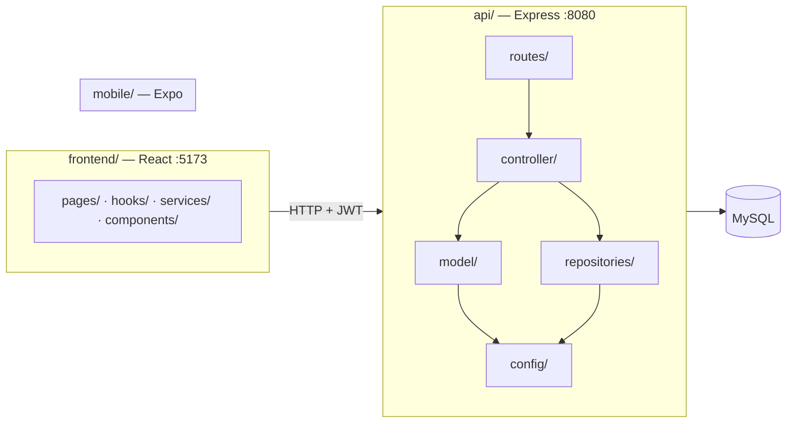

# Rotina Plus

<div align="center">
  
</div>

Gerenciador de tarefas com pontuação. Você cria tarefas com prazo e prioridade, conclui e acumula pontos — Baixa vale 5, Media vale 10, Alta vale 20.

[](https://nodejs.org)
[](https://react.dev)
[](https://expressjs.com)
[](https://www.mysql.com)
[](https://developer.mozilla.org/docs/Web/JavaScript)

## Funcionalidades

- **Conta com verificação por e-mail** — link de uso único, válido por 24 h.
- **Login com sessão JWT** de 2 h.
- **Recuperação de senha por e-mail** — link de 1 h, uso único.
- **Painel de tarefas** organizado em abas *Hoje* e *Futuras*, com seções de abertas e concluídas.
- **Pontuação automática** por prioridade ao concluir, com total acumulado no topo do painel.
- **Indicador de constância** — quantos dias distintos o usuário concluiu ao menos uma tarefa.
- **Tema claro/escuro** nas telas de acesso.

## Stack

| Parte | Tecnologia |
| :--- | :--- |
| `frontend/` | React 19, Vite, React Router, Bootstrap 5, axios |
| `api/` | Node.js, Express 5 (ESM), MySQL (`mysql2`), JWT, bcrypt, nodemailer |
| `mobile/` | Expo / React Native — **não integrado** |

JavaScript e JSX puros, sem TypeScript.

## Estrutura



Cada pasta é um pacote independente — **não existe `package.json` na raiz** nem ferramenta de workspace. Instale e rode cada uma separadamente.

```
Rotina-Plus/
├── api/                 # API Express
│   └── src/
│       ├── config/      # pool MySQL (singleton) e transporter de e-mail
│       ├── controller/  # regras de negócio e status HTTP
│       ├── middlewares/ # validação do JWT
│       ├── model/       # classes de domínio
│       ├── repositories/# SQL
│       ├── routes/      # mapeamento método → caminho → controller
│       └── enum/
├── frontend/            # app React
│   └── src/
│       ├── components/
│       ├── hooks/
│       ├── pages/
│       └── services/    # axios
├── mobile/              # Expo, não integrado
├── docs/                # documentação
└── rotinaplus.sql       # dump do banco
```

## Instalação

**Pré-requisitos:** Node.js 25+, MySQL 8 (ou MariaDB 11) e uma conta Gmail com *App Password* para o envio de e-mails.

### 1. Banco de dados

```bash
mysql -u root -p -e "CREATE DATABASE rotinaplus CHARACTER SET utf8mb4;"
mysql -u root -p rotinaplus < rotinaplus.sql
```

O dump cria quatro tabelas: `usuarios`, `tarefas`, `pontos` e `autenticacao`. Nenhuma configuração adicional é necessária.

### 2. API

```bash
cd api
npm install
cp .env.example .env
```

Preencha o `.env`:

| Variável | Descrição |
| :--- | :--- |
| `PORT` | Porta da API. Padrão usado em desenvolvimento: `8080` |
| `DB_HOST`, `DB_PORT`, `DB_USER`, `DB_PASSWORD`, `DB_DATABASE` | Conexão com o MySQL |
| `JWT_SECRET` | Assina os tokens de sessão e de link. Use um valor longo e aleatório |
| `FRONTEND_URL` | Base dos links enviados por e-mail. Ex.: `http://localhost:5173` |
| `EMAIL_USER` | Endereço remetente do Gmail |
| `EMAIL_PASS` | *App Password* do Gmail |

```bash
node src/server.js
```

> **Use `node src/server.js`, não `npm start`.** O script `start` do `package.json` chama `nodemon`, que não está instalado. (Alternativa: `npm install -D nodemon`.)

O servidor precisa subir depois do MySQL: o pool é criado na importação do módulo de conexão, e sem o banco acessível o processo falha imediatamente.

### 3. Frontend

```bash
cd frontend
npm install
npm run dev
```

Acesse `http://localhost:5173`. O CORS da API libera apenas `http://localhost:5173`, e o frontend aponta fixamente para `http://localhost:8080` — ambos estão no código, não em variável de ambiente.

## Scripts

| Comando | Onde | O que faz |
| :--- | :--- | :--- |
| `node src/server.js` | `api/` | Sobe a API |
| `npm run dev` | `frontend/` | Servidor de desenvolvimento do Vite |
| `npm run build` | `frontend/` | Build de produção |
| `npm run lint` | `frontend/` | ESLint |
| `npm start` | `mobile/` | Expo (**template não integrado**) |

`npm test` na API é o stub padrão do npm e sempre sai com erro: **o projeto não tem testes automatizados**.

## Documentação

Toda a documentação está em [`docs/`](./docs/README.md):

| Documento | Assunto |
| :--- | :--- |
| [Arquitetura](./docs/arquitetura.md) | Stack, camadas, fluxos de autenticação e decisões técnicas |
| [Guia de usuário](./docs/guia-usuario.md) | Como usar o sistema |
| [API](./docs/api.md) | Todos os endpoints com request, response e status codes |
| [Diagrama de classes](./docs/classes.md) | Classes e módulos do backend |
| [Modelo de dados](./docs/database.md) | Tabelas, colunas, ER e inconsistências do schema |
| [Design System](./docs/designSystem.md) | Paleta, tipografia e componentes |

## Estado do projeto

Coisas que ainda não funcionam ou não estão prontas, para evitar surpresa:

- **`mobile/` não está integrado.** É o template do Expo; o formulário de login tem um `TODO` de integração e o componente não compila, pois importa `@expo/vector-icons` sem estar em `package.json`.
- **As rotas de `/api/users` e `/api/tasks` não exigem autenticação**, apesar de importarem os middlewares. `GET /api/users` expõe nome e e-mail de todos os cadastros.
- **Não há como deslogar revogando a sessão.** Trocar a senha não invalida JWTs já emitidos — sessões abertas duram até 2 h.
- **`/auth/forgot-password` responde `404` para e-mail inexistente**, o que confirma se um endereço está cadastrado.
- **Falha de envio de e-mail deixa o usuário pela metade:** a conta é gravada e a resposta é `500`, sem forma de reenviar o botão pelo app.
- **Não há `ON DELETE CASCADE`.** Apagar usuário com tarefas falha por constraint; apagar tarefa remove os pontos na mão, no código.
- **Sem testes e sem CI/CD.**
- **Erro de lint pré-existente** em `frontend/src/pages/Dashboard.jsx` (`react-hooks/set-state-in-effect`).
- **Dependências não utilizadas na API:** `axios`, `multer`, `fs` e `path` estão declaradas e nunca são importadas — vale removê-las, em especial `fs@0.0.1-security`, que é um pacote de espaço reservado e não o módulo nativo do Node.

A lista completa está em [Limitações conhecidas](./docs/arquitetura.md#12-limitações-conhecidas).
