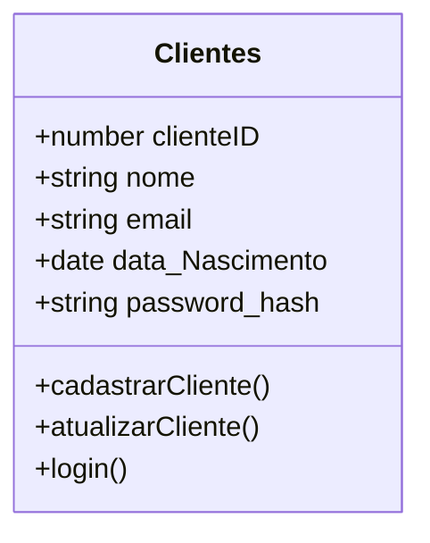
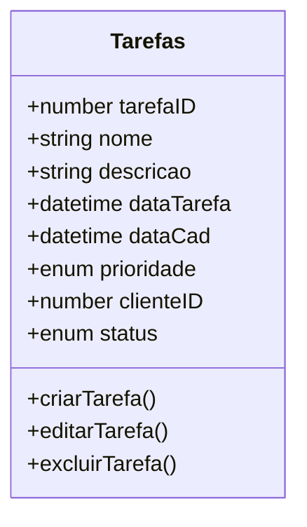
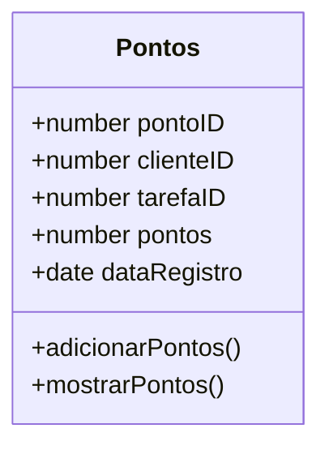
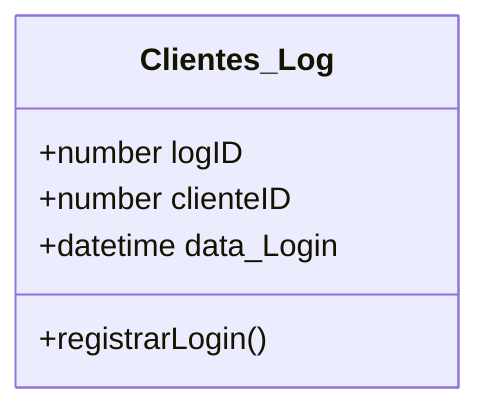
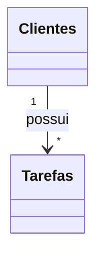
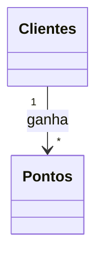
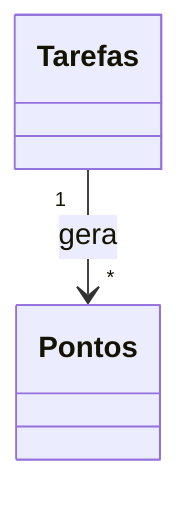
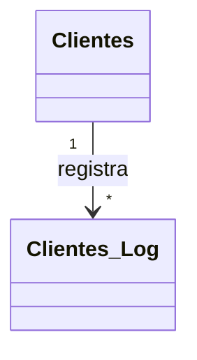
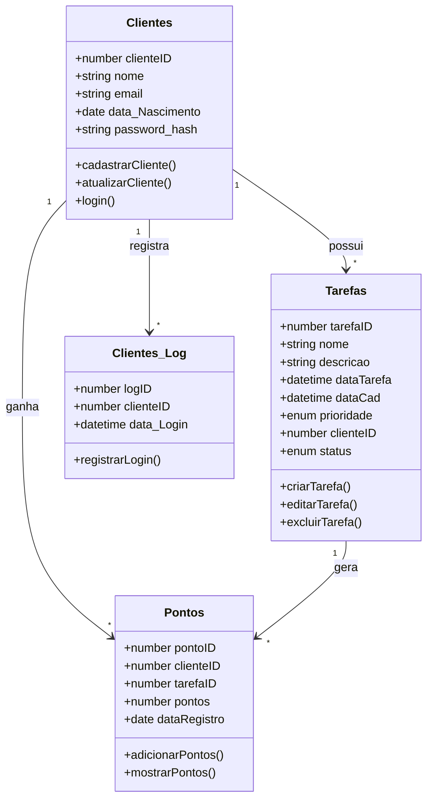

# Diagrama de Classes

Esse documento mostra as principais classes do sistema e os relacionamentos entre elas.

---

# Classe: Clientes

## Descrição
Essa classe representa os clientes cadastrados no sistema.

## Atributos
- clienteID : number
- nome : string
- email : string
- data_Nascimento : date
- password_hash : string

## Métodos
- cadastrarCliente()
- atualizarCliente()
- login()

---

# Classe: Tarefas

## Descrição
Essa classe representa as tarefas criadas pelos clientes.

## Atributos
- tarefaID : number
- nome : string
- descricao : string
- dataTarefa : datetime
- dataCad : datetime
- prioridade : enum
- clienteID : number
- status : enum

## Métodos
- criarTarefa()
- editarTarefa()
- excluirTarefa()

---

# Classe: Pontos

## Descrição
Essa classe guarda os pontos que o cliente ganhou ao completar tarefas.

## Atributos
- pontoID : number
- clienteID : number
- tarefaID : number
- pontos : number
- dataRegistro : date

## Métodos
- adicionarPontos()
- mostrarPontos()

---

# Classe: Clientes_Log

## Descrição
Essa classe salva o histórico de login dos clientes.

## Atributos
- logID : number
- clienteID : number
- data_Login : datetime

## Métodos
- registrarLogin()

---

# Relacionamentos

## Clientes e Tarefas

Um cliente pode ter várias tarefas.

---

## Clientes e Pontos

Um cliente pode ter vários registros de pontos.

---

## Tarefas e Pontos

Uma tarefa pode gerar pontos.

---

## Clientes e Clientes_Log

Um cliente pode ter vários registros de login.

---

# Diagrama Completo

