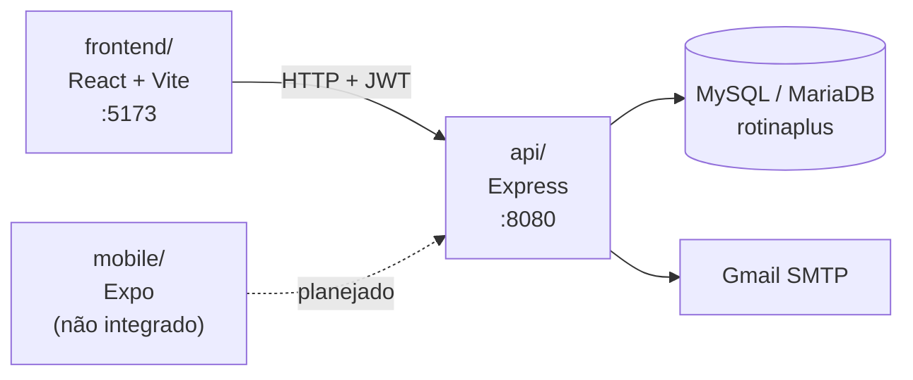

# Documentação — Rotina Plus

Índice de toda a documentação do projeto. Comece pelo [guia de arquitetura](./arquitetura.md) para entender como o sistema é montado, ou vá direto ao que precisa.

## Mapa da documentação

| Documento | Conteúdo | Para quem |
| :--- | :--- | :--- |
| [Arquitetura](./arquitetura.md) | Visão geral, stack, camadas, fluxo de requisição, decisões técnicas | Quem vai mexer no código |
| [Guia de usuário](./guia-usuario.md) | Passo a passo de como usar o Rotina Plus na prática | Quem usa o sistema |
| [API](./api.md) | Especificação de todos os endpoints (request, response, status) | Quem consome a API / integra |
| [Diagrama de classes](./classes.md) | Classes reais do backend e seus relacionamentos | Quem vai mexer no código |
| [Modelo de dados](./database.md) | Tabelas, colunas, chaves, diagrama ER | Quem mexe no banco |
| [Design System](./designSystem.md) | Paleta, tipografia, espaçamento, componentes | Quem mexe no frontend |
| [Banco de dados (dump)](./DataBase.sql) | Script SQL com o schema | Quemprovisiona o banco |
| [Coleção Insomnia](./Insomnia.yaml) | Requisições prontas para teste | Quem testa a API |

## Visão rápida

O Rotina Plus é um gerenciador de tarefas com pontuação por usuário. É um **monorepo com três partes independentes** — não existe `package.json` na raiz nem ferramenta de workspace (nada de npm workspaces, turbo ou lerna). Cada pasta tem seu próprio `package.json` e precisa ser instalada e rodada separadamente.

## Onde começar

**Para rodar o projeto:** o [README da raiz](../README.md#instalação) tem o passo a passo de instalação e as variáveis de ambiente.

**Para entender o código:** comece pelo [guia de arquitetura](./arquitetura.md). A seção [Organização do código](./arquitetura.md#organização-do-código) mapaia cada pasta, e [Camadas da API](./arquitetura.md#camadas-da-api) explica o fluxo `routes → controller → repository → banco`.

**Para consumir a API:** [api.md](./api.md) tem todos os endpoints com exemplos de request e response.

## Estado atual da documentação

Registrado para deixar claro o que ainda não existe, em vez de deixar implícito:

- **Sem testes automatizados.** Não há suíte em nenhuma das três partes. O `npm test` da API é o stub padrão do npm e sempre sai com erro.
- **Sem CI/CD.** Não há configuração de pipeline no repositório.
- **Aplicativo mobile não integrado.** O código em `mobile/` é o template do Expo; o formulário de login tem um `TODO` de integração com a API e não consome nenhum endpoint.
- **Imagens de diagrama em `docs/images/diagram/` desatualizadas.** Elas representam um schema antigo com `Clientes`/`ClienteID` numérico. O schema atual é o de [Modelo de dados](./database.md). As imagens foram desreferenciadas dos documentos, mas os arquivos continuam no repositório aguardando regeneração.