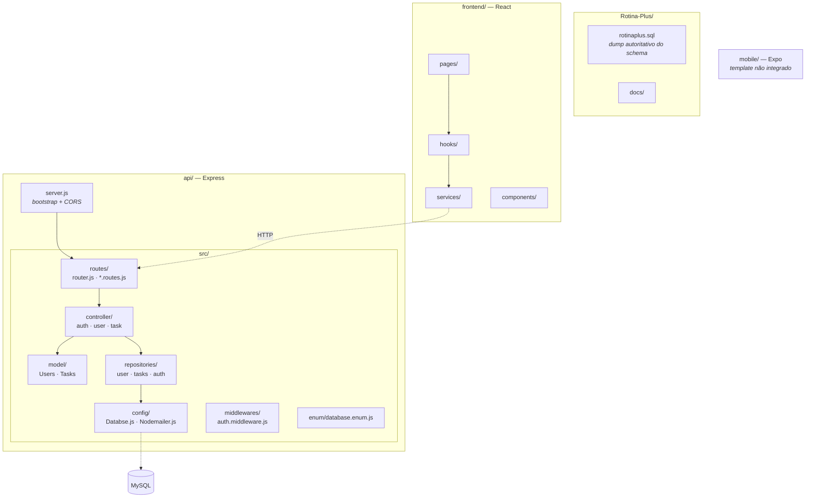
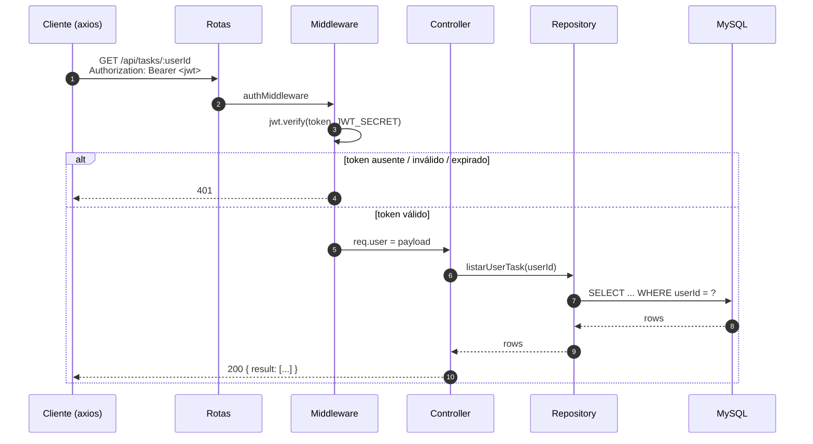
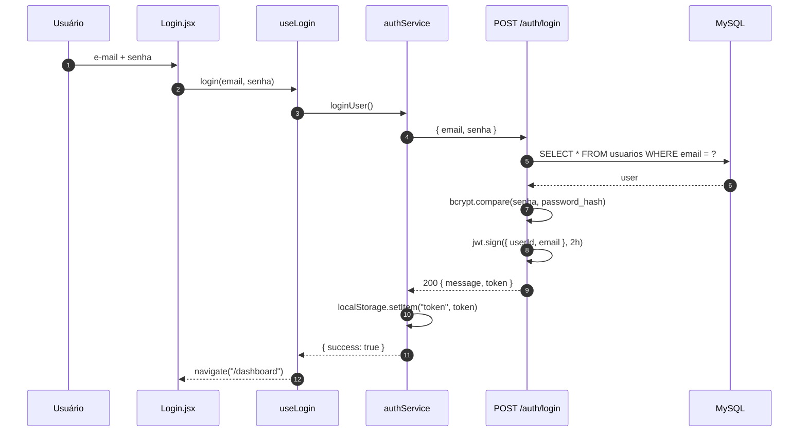
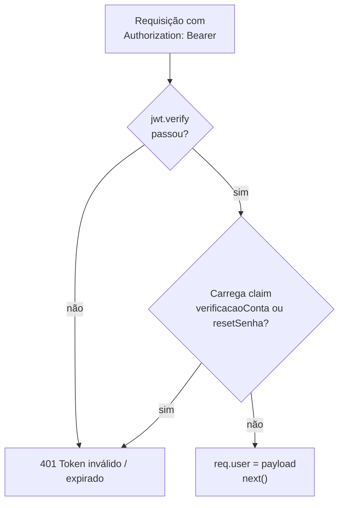
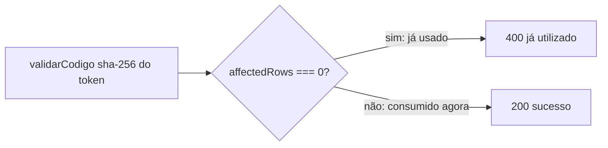
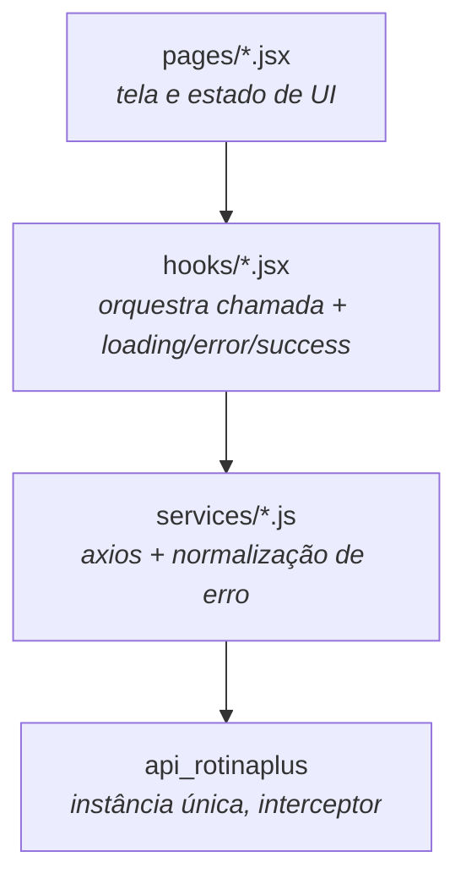
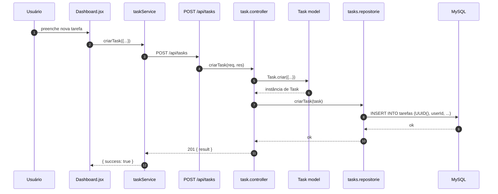

# Guia de Arquitetura

Como o Rotina Plus é estruturado, como uma requisição percorre o sistema e por que ele foi construído assim.

---

## 1. Visão geral

O Rotina Plus é um gerenciador de tarefas com pontuação: o usuário cria tarefas com prioridade e prazo, e recebe pontos ao concluí-las. Existem três partes de código — aplicação web, API e banco — mais um aplicativo mobile ainda não integrado.

## 2. Stack

| Camada | Tecnologia | Versão |
| :--- | :--- | :--- |
| Frontend | React + Vite | 19.2 / 8.x |
| Roteamento | React Router (`react-router-dom` 7.x; há também `react-router` 8.x sem uso evidente) | 7.18 |
| Estilo | Bootstrap | 5.3 |
| HTTP | axios | — |
| Backend | Express (ESM, `"type": "module"`) | 5.x |
| Banco | MariaDB / MySQL, driver `mysql2` | — |
| Autenticação | `jsonwebtoken` + `bcrypt` | — |
| E-mail | `nodemailer` via SMTP do Gmail | — |
| Mobile | Expo / React Native (não integrado) | SDK 54 |
| Runtime | Node.js | 25.x |

Não há TypeScript em lugar nenhum: todo o código é JavaScript/JSX puro.

## 3. Organização do código



### Responsabilidade de cada pasta (API)

| Pasta | Responsabilidade | Pode importar de |
| :--- | :--- | :--- |
| `routes/` | Declara método, caminho e middlewares. Não contém lógica. | `controller`, `middlewares` |
| `controller/` | Valida entrada, orquestra a regra de negócio, monta a resposta HTTP. | `model`, `repositories`, `config` |
| `model/` | Classes de domínio com campos privados e métodos estáticos de fábrica. | nada (folha) |
| `repositories/` | SQL puro. É a **única** camada que conhece tabela e coluna. | `config` |
| `config/` | Pool de conexões e transporter de e-mail. Singleton. | — |
| `middlewares/` | Intercepta a requisição antes do controller (autenticação). | — |
| `enum/` | Constantes que espelham ENUMs do banco. | — |

Os repositories são objetos literais exportados, não classes. Os controllers também.

## 4. Camadas da API

O caminho de uma requisição é sempre o mesmo:



Regras que o código respeita hoje:

1. **Só o repository escreve SQL.** Nenhum controller monta query.
2. **O controller devolve status HTTP.** Erros de regra de negócio viram `400`; recurso ausente, `404`; exceção não tratada, `500`.
3. **O middleware não conhece regra de negócio.** Ele só valida o token e injeta `req.user`.

## 5. Autenticação

### 5.1 Sessão

O login valida a senha com `bcrypt.compare` e devolve um **JWT de 2 horas** com o payload `{ userId, email }`. O frontend guarda esse token em `localStorage["token"]` e um interceptor do axios o injeta como `Authorization: Bearer` em toda requisição que **não** seja `/auth/*`.



A proteção de rota no frontend (`ProtectedRoute` em `App.jsx`) verifica **apenas se existe um token no `localStorage`** — não valida expiração. Um token expirado deixa o usuário passar pela tela e só recebe `401` na primeira chamada à API.

### 5.2 Tokens de link (verificação de conta e redefinição de senha)

Os dois fluxos por e-mail seguem o mesmo padrão, e **não exigem alteração no banco**: o token é um JWT assinado com a mesma chave, e seu SHA-256 é gravado na tabela `autenticacao` para garantir uso único.

| Fluxo | Claim | Validade | Rota que consome |
| :--- | :--- | :--- | :--- |
| Verificação de conta | `verificacaoConta` | 24 h | `POST /auth/verify` |
| Redefinição de senha | `resetSenha` | 1 h | `POST /auth/reset-password` |

**Claim de separação.** Por usar o mesmo `JWT_SECRET`, um token de link poderia ser aceito como token de sessão. Por isso `auth.middleware.js` rejeita explicitamente qualquer token que carregue `verificacaoConta` ou `resetSenha`:



**Uso único sem coluna nova.** O token só é considerado consumido se o `UPDATE` realmente alterar a linha:



Esse detalhe depende de a linha estar com `isvalid = 1`. Como a tabela `autenticacao` não tem coluna que diferencie a finalidade do token, **`invalidarCodigos(userId)` não pode ser usado para revogar tokens**: ele invalidaria também o token de outro fluxo do mesmo usuário. Ver [Limitações conhecidas](#12-limitações-conhecidas).

## 6. Frontend

### 6.1 Separação de responsabilidades



O padrão é sempre o mesmo: a **página** cuida só de render, o **hook** cuida de `loading`/`error`/`success`, e o **service** faz a chamada HTTP e converte exceção em `{ success, message }`. Nenhuma página chama axios diretamente.

`isAuthenticated()` e `logout()` vivem no service de autenticação, mas o interceptor lê o `localStorage` direto para evitar import circular — os dois precisam concordar com a chave `"token"`.

### 6.2 Rotas

| Rota | Tela | Acesso |
| :--- | :--- | :--- |
| `/` | Home (landing) | público |
| `/login` | Login | público |
| `/register` | Cadastro (2 etapas) | público |
| `/verificar-email` | Resultado da verificação | público |
| `/esqueci-senha` | Solicitar redefinição | público |
| `/redefinir-senha` | Formulário de nova senha | público |
| `/dashboard` | Lista de tarefas | exige token |
| `*` | Redireciona para `/` | — |

## 7. Configuração

Variáveis lidas por `dotenv` a partir de `api/.env`. `.env.example` traz o modelo.

| Variável | Usada em | Observação |
| :--- | :--- | :--- |
| `PORT` | `server.js` | padrão de desenvolvimento: `8080` |
| `FRONTEND_URL` | controller de auth | monta o link dos botões do e-mail |
| `DB_HOST` `DB_USER` `DB_PASSWORD` `DB_DATABASE` `DB_PORT` | `config/Databse.js` | — |
| `JWT_SECRET` | login e verificação de token | assina sessão e tokens de link |
| `EMAIL_USER` `EMAIL_PASS` | `config/Nodemailer.js` | credenciais SMTP do Gmail |
| `SALT` | — | **declarada e nunca usada**; o `saltRounds` é fixo em `10` |

**CORS e URL da API são fixos no código.** `server.js:11` libera apenas `http://localhost:5173`, e `services/api.js:4` aponta para `http://localhost:8080`. Não há indireção por ambiente — para deploy em outro host é preciso editar código, não variáveis.

**Comunicação com Gmail.** O projeto usa SMTP do Gmail, que exige *App Password* (a senha normal da conta não funciona) e tem limite de envios por dia.

## 8. Decisões técnicas

**JWT stateless para a sessão.** Evita armazenamento de sessão no servidor e permite escalar horizontalmente sem estado compartilhado. O custo é que não existe revogação: um token emitido continua válido até expirar, mesmo após troca de senha.

**Token de link como JWT, não valor aleatório.** Um token opaco exigiria uma coluna indexável para ser encontrado no banco. Como a tabela `autenticacao` só tem `hashCode`, guardar o SHA-256 e procurar por ele funciona; o bcrypt resolveria a comparação mas não a busca.

**`UUID()` gerado no SQL.** Os repositories usam `UUID()` do próprio banco em vez de gerar no JavaScript. Isso evita uma dependência e mantém o ID no mesmo formato em toda a aplicação.

**Sem ORM.** SQL escrito à mão nos repositories. Com quatro tabelas o custo é baixo e o/schema fica explícito.

**`char(36)` em vez de `BINARY(16)`.** Legível em dumps e no console do MySQL ao custo de espaço.

## 9. Como rodar

```bash
# 1) Banco — criar o schema
mysql -u root -p < rotinaplus.sql

# 2) API
cd api
npm install
cp .env.example .env   # preencher as variáveis
node src/server.js     # http://localhost:8080
```

```bash
# 3) Frontend
cd frontend
npm install
npm run dev            # http://localhost:5173
```

Rode o MySQL antes da API: o pool é criado na importação de `config/Databse.js`, e sem o banco acessível o processo falha ao subir.

> **Atenção:** o script `npm start` da API invoca `nodemon`, que **não está em `package.json`**. Use `node src/server.js`, ou instale o `nodemon` como dependência de desenvolvimento.

## 10. Onde o mobile se encaixa

`mobile/` é o template do Expo, sem integração. `components/login-forms.js` tem um `TODO` explícito de integração com o serviço de autenticação e importa `@expo/vector-icons`, que não está em `package.json` — ou seja, o componente não compila como está. O guia de arquitetura considera o mobile como consumidor futuro da mesma API descrita em [api.md](./api.md); nenhuma rota nova é necessária do lado do backend para conectá-lo.

## 11. Fluxo de dados de uma tarefa



Ao concluir, `PUT /api/tasks/:UUID/concluir` muda o `status` para `Concluida` e credita os pontos em `pontos`, que alimenta o ranking.

## 12. Limitações conhecidas

Documentadas aqui para não se perderem no código:

- **`GET /api/users` não exige autenticação.** As rotas importam `authMiddleware` e `authAdmin` mas não os aplicam, então a lista de usuários — incluindo e-mails — está pública.
- **`authAdmin` e `authUser` nunca são usados.** Ambos verificam uma claim `role` que o login não emite, então mesmo se fossem aplicados rejeitariam todo mundo.
- **Sessões não são revogáveis.** Trocar a senha não invalida JWT já emitido (2 h de janela). Recuperar a conta também deixa sessões antigas válidas.
- **Pedidos repetidos de redefinição acumulam tokens válidos.** Sem coluna de finalidade, não dá para revogar o anterior sem afetar o outro fluxo.
- **`/auth/forgot-password` responde `404` para e-mail inexistente**, o que confirma se um e-mail está cadastrado.
- **Envio de e-mail engole falha.** No cadastro e na redefinição uma falha de SMTP resulta em `500`, e o usuário já foi gravado — restando uma conta sem forma de verificar pela tela.
- **Sem teste automatizado** em nenhuma das três partes.
- **Erro de lint pré-existente** em `frontend/src/pages/Dashboard.jsx` (`react-hooks/set-state-in-effect`), na linha que chama `carregar()` dentro do `useEffect`.
- **`api/src/view/autenticacao.html` está órfão.** O e-mail é montado inline no controller; esse template não é importado por lugar nenhum.