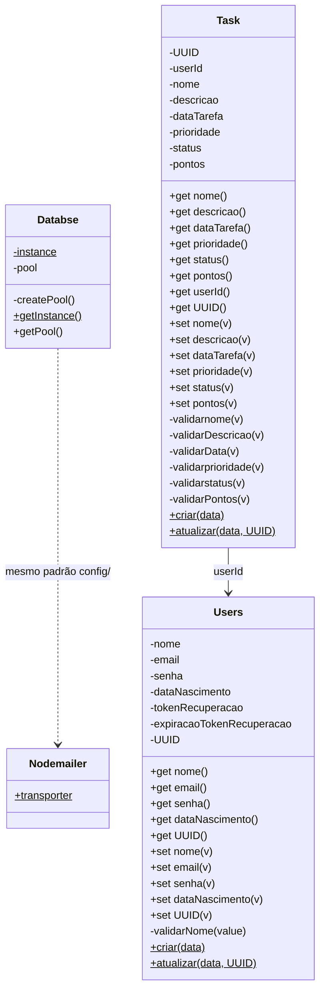
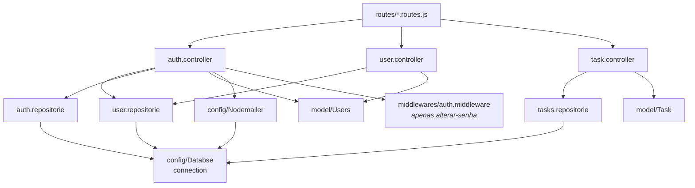

# Diagrama de Classes

As classes e módulos que compõem o backend. Todas vivem em `api/src/`.

> **Nota de nomenclatura:** os nomes abaixo refletem o código como ele está, inclusive as inconsistências. `Databse` está escrito sem o "a" no arquivo, e a classe de tarefa chama-se `Task` (singular) enquanto o arquivo chama-se `Tasks.js`.

---

## 1. Visão geral

O backend tem apenas **duas classes de domínio** (`Users` e `Task`) e **uma classe de infraestrutura** (`Databse`). Controllers, repositories e o middleware não são classes — são objetos literais com funções exportadas.



## 2. `Databse` — `config/Databse.js`

Singleton que mantém um único pool de conexões do `mysql2`. O export do arquivo já é a instância pronta:

```js
export const connection = Databse.getInstance().getPool();
```

Isso significa que **importar qualquer repository abre o pool**. Não há `close()` nem `try/catch` na criação: se o MySQL estiver inacessível, a API falha na importação, antes de subir o Express.

Configuração do pool: `waitForConnections: true`, `connectionLimit: 100`, `queueLimit: 0` (fila ilimitada).

## 3. `Users` — `model/Users.js`

Classe de domínio do usuário. Todos os campos são privados (`#`), acessados por `get`/`set`.

| Método | O que faz |
| :--- | :--- |
| `static criar(data)` | Instância **sem** UUID — o ID é gerado pelo banco no `INSERT`. |
| `static atualizar(data, UUID)` | Instância **com** UUID já conhecido. |

Os dois factories usam a mesma forma de chamada e diferem só no argumento `UUID`, que é `null` no primeiro e o valor recebido no segundo.

### Campos sem uso

`#tokenRecuperacao` e `#expiracaoTokenRecuperacao` existem na classe com seus getters, mas **não têm coluna correspondente no banco** e nenhuma requisição os preenche. São herança de um fluxo de recuperação de senha abandonado: a recuperação atual usa JWT e a tabela `autenticacao`. Os getters são lidos em nenhum lugar do código.

## 4. `Task` — `model/Tasks.js`

Classe de domínio da tarefa, com o mesmo padrão de campos privados e factories estáticos.

O campo `#pontos` existe na classe, mas **`tarefas` não tem coluna `pontos`**. A pontuação vive na tabela `pontos`, e o valor é calculado pela prioridade no repository (Baixa 5, Media 10, Alta 20). O `Task.criar()` recebe `data.pontos` e o transporta, mas o controller não envia esse campo ao criar — então chega `undefined`.

### Validadores privados nunca chamados

`#validarnome`, `#validarDescricao`, `#validarData`, `#validarprioridade`, `#validarstatus` e `#validarPontos` lançam `Error` quando o valor é inválido, **mas nenhum deles é invocado** — nem pelos factories `criar`/`atualizar`, nem pelos setters, que só atribuem. A validação real acontece no controller e, em parte, no banco pelos ENUMs.

Isso é relevante ao ler o código: **um `new Task({nome: ""})` não lança erro**, apesar de haver um validador que aparentemente faria isso.

## 5. Módulos que não são classes

| Módulo | Forma | Export |
| :--- | :--- | :--- |
| `controller/auth.controller.js` | objeto literal | `authController` |
| `controller/user.controller.js` | objeto literal | `userController` |
| `controller/task.controller.js` | objeto literal | `tasksController` |
| `repositories/user.repositorie.js` | objeto literal | `usersRepository` |
| `repositories/tasks.repositorie.js` | objeto literal | `tasksRepositories` |
| `repositories/auth.repositorie.js` | objeto literal | `authRepositorie` |
| `middlewares/auth.middleware.js` | funções soltas | `authMiddleware`, `authAdmin`, `authUser` |
| `config/Nodemailer.js` | objeto literal | `transporter` |
| `enum/database.enum.js` | constantes | `statusEnum`, `prioridadeEnum` |

## 6. Quem depende de quem



Nenhuma seta sai de `model/` — os models são folha e não importam nada do projeto. Nenhum repository importa model: o SQL é montado a partir de objetos simples.

## 7. Middlewares

Os três middlewares de `middlewares/auth.middleware.js` verificam a mesma coisa (assinatura do JWT) e divergem só no tratamento:

| Middleware | Comportamento |
| :--- | :--- |
| `authMiddleware` | Valida o token, injeta `req.user` e chama `next()`. |
| `authAdmin` | Além de `authMiddleware`, exige `role === "admin"`. |
| `authUser` | Além de `authMiddleware`, exige `role === "user"`. |

`authMiddleware` também rejeita tokens que carregam `verificacaoConta` ou `resetSenha` — tokens de link por e-mail não podem ser usados como sessão.

Só `authMiddleware` é aplicado no código, e apenas na rota `PUT /auth/alterar-senha`. `authAdmin` e `authUser` nunca são usados, e exigiriam uma claim `role` que o login não emite.

## 8. Mapeamento classe ↔ tabela

| Classe | Tabela | Observação |
| :--- | :--- | :--- |
| `Users` | `usuarios` | UUID gerado pelo banco. `senha` é o hash bcrypt, gravado em `password_hash`. |
| `Task` | `tarefas` | Sem coluna `pontos`; a pontuação fica em `pontos`. |
| `Databse` | — | Sem tabela; é a conexão. |
| (auth repository) | `autenticacao` | Guarda o SHA-256 do token de link. Sem classe própria. |
| (task repository) | `pontos` | Sem classe própria. |

O detalhe completo das colunas está em [Modelo de dados](./database.md).
