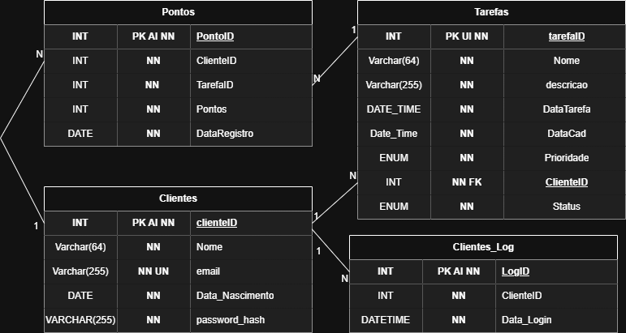
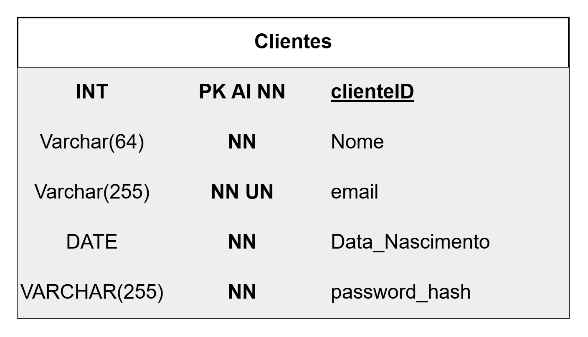
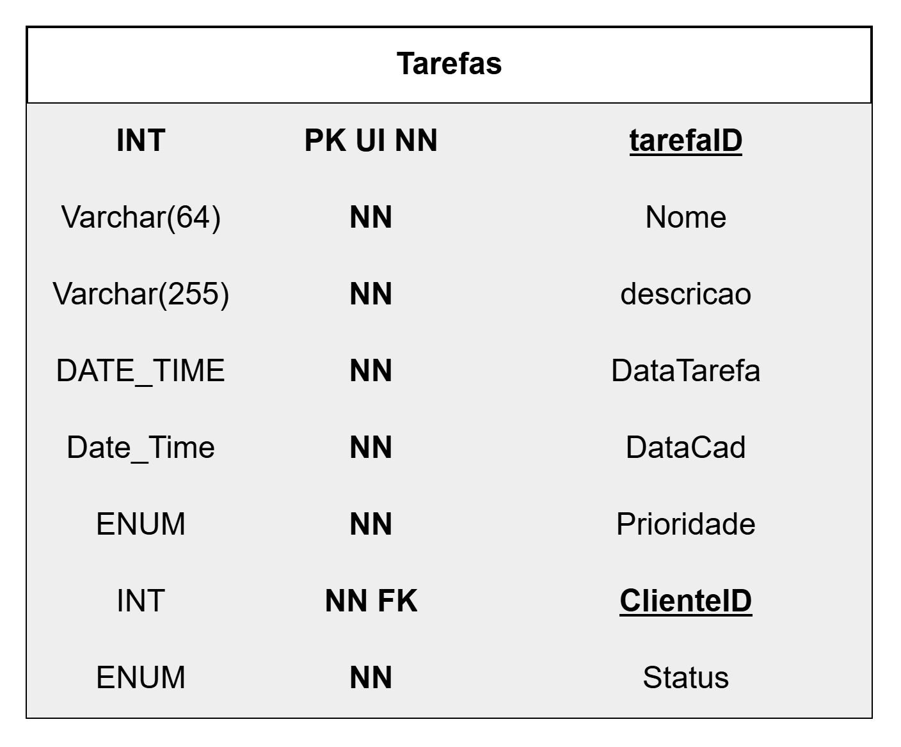
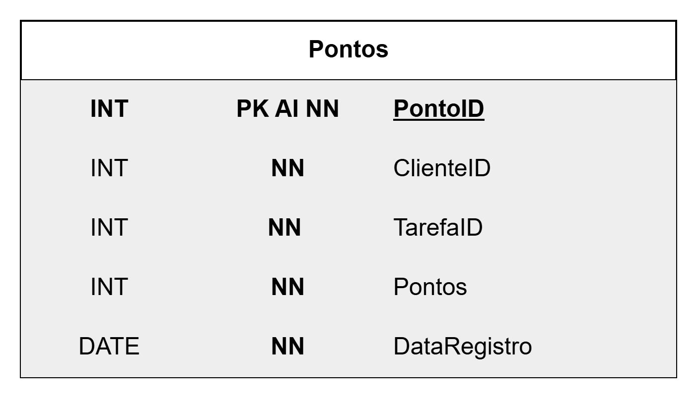
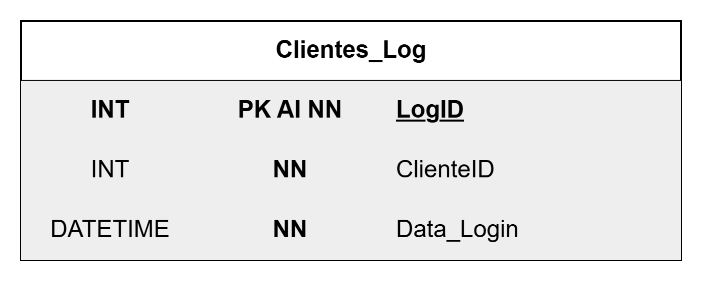
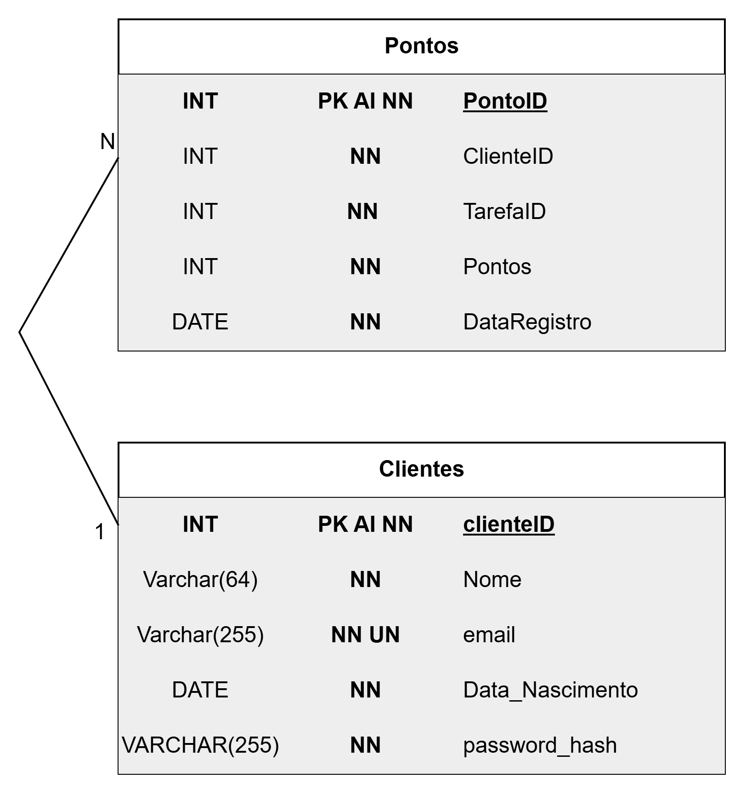
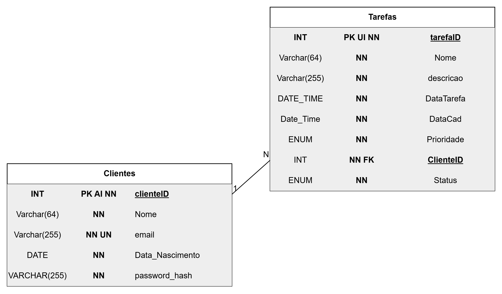
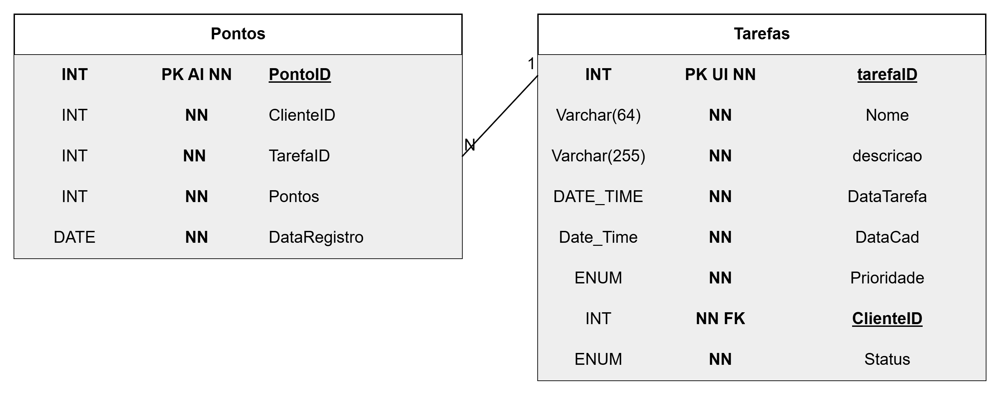
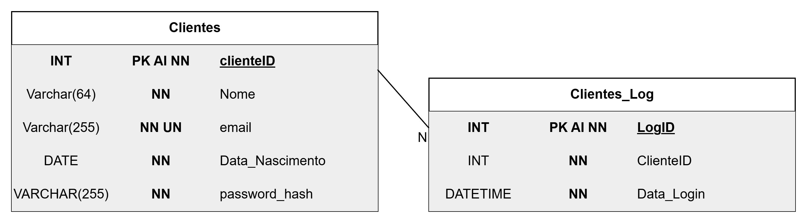

# Modelo de Dados

## Diagrama Geral

## Entidade: Clientes

### Descricao

Armazena os dados principais dos usuarios cadastrados no sistema Rotina Plus.

### Atributos

| Tipo         | Nome            | Atributos |
| :----------- | :-------------- | :-------- |
| INT          | clienteID       | PK AI NN  |
| Varchar(64)  | Nome            | NN        |
| Varchar(255) | email           | NN UN     |
| DATE         | Data_Nascimento | NN        |
| VARCHAR(255) | password_hash   | NN        |

## Entidade: Tarefas

### Descricao

Armazena as tarefas criadas pelos clientes, incluindo data, prioridade e status.

### Atributos

| Tipo         | Nome       | Atributos |
| :----------- | :--------- | :-------- |
| INT          | tarefaID   | PK UI NN  |
| Varchar(64)  | Nome       | NN        |
| Varchar(255) | descricao  | NN        |
| DATE_TIME    | DataTarefa | NN        |
| Date_Time    | DataCad    | NN        |
| ENUM         | Prioridade | NN        |
| INT          | ClienteID  | NN FK     |
| ENUM         | Status     | NN        |

## Entidade: Pontos

### Descricao

Registra a pontuacao atribuida a um cliente por uma tarefa.

### Atributos

| Tipo | Nome         | Atributos |
| :--- | :----------- | :-------- |
| INT  | PontoID      | PK AI NN  |
| INT  | ClienteID    | NN        |
| INT  | TarefaID     | NN        |
| INT  | Pontos       | NN        |
| DATE | DataRegistro | NN        |

## Entidade: Clientes_Log

### Descricao

Registra os acessos realizados pelos clientes no sistema.

### Atributos

| Tipo     | Nome       | Atributos |
| :------- | :--------- | :-------- |
| INT      | LogID      | PK AI NN  |
| INT      | ClienteID  | NN        |
| DATETIME | Data_Login | NN        |

## Relacionamento: Clientes x Pontos

### Descricao

Um cliente pode possuir varios registros de pontos, e cada registro de pontos pertence a um unico cliente.

### Estrutura

| Propriedade       | Valor                                      |
| :---------------- | :----------------------------------------- |
| Chave primaria    | `Clientes.clienteID`                       |
| Chave estrangeira | `Pontos.ClienteID`                         |
| Referencia        | `Pontos.ClienteID` -> `Clientes.clienteID` |
| Cardinalidade     | `Clientes` 1:N `Pontos`                    |

## Relacionamento: Clientes x Tarefas

### Descricao

Um cliente pode cadastrar varias tarefas, e cada tarefa pertence a um unico cliente.

### Estrutura

| Propriedade       | Valor                                       |
| :---------------- | :------------------------------------------ |
| Chave primaria    | `Clientes.clienteID`                        |
| Chave estrangeira | `Tarefas.ClienteID`                         |
| Referencia        | `Tarefas.ClienteID` -> `Clientes.clienteID` |
| Cardinalidade     | `Clientes` 1:N `Tarefas`                    |

## Relacionamento: Pontos x Tarefas

### Descricao

Uma tarefa pode gerar varios registros de pontos, e cada registro de pontos esta associado a uma unica tarefa.

### Estrutura

| Propriedade       | Valor                                   |
| :---------------- | :-------------------------------------- |
| Chave primaria    | `Tarefas.tarefaID`                      |
| Chave estrangeira | `Pontos.TarefaID`                       |
| Referencia        | `Pontos.TarefaID` -> `Tarefas.tarefaID` |
| Cardinalidade     | `Tarefas` 1:N `Pontos`                  |

## Relacionamento: Clientes x Clientes_Log

### Descricao

Um cliente pode possuir varios registros de login, e cada registro de login pertence a um unico cliente.

### Estrutura

| Propriedade       | Valor                                            |
| :---------------- | :----------------------------------------------- |
| Chave primaria    | `Clientes.clienteID`                             |
| Chave estrangeira | `Clientes_Log.ClienteID`                         |
| Referencia        | `Clientes_Log.ClienteID` -> `Clientes.clienteID` |
| Cardinalidade     | `Clientes` 1:N `Clientes_Log`                    |
