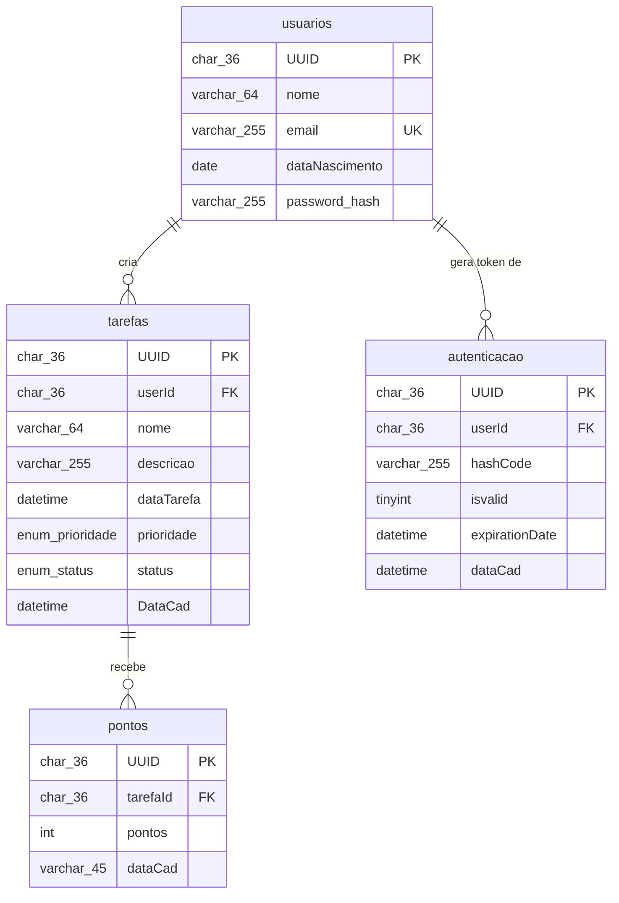

# Modelo de Dados

Schema do banco do Rotina Plus. Todas as tabelas são InnoDB, `utf8mb4`, com chaves primárias `char(36)` geradas por `UUID()`.

> **Fonte:** `rotinaplus.sql` na raiz do repositório (dump gerado por MySQL 8.0.46 a partir de um servidor MariaDB 11.8.9). `docs/DataBase.sql` é um dump equivalente do mesmo schema — os dois descrevem as mesmas quatro tabelas, com as mesmas chaves. **Nenhuma alteração de schema é necessária** para os fluxos de verificação de conta e redefinição de senha: ambos reaproveitam a tabela `autenticacao`.

---

## 1. Diagrama de relacionamentos


```mermaid
erDiagram
    usuarios ||--o{ tarefas : "cria"
    usuarios ||--o{ autenticacao : "gera token de"
    tarefas ||--o{ pontos : "recebe"

    usuarios {
        char_36 UUID PK
        varchar_64 nome
        varchar_255 email UK
        date dataNascimento
        varchar_255 password_hash
    }

    tarefas {
        char_36 UUID PK
        char_36 userId FK
        varchar_64 nome
        varchar_255 descricao
        datetime dataTarefa
        enum_prioridade prioridade
        enum_status status
        datetime DataCad
    }

    autenticacao {
        char_36 UUID PK
        char_36 userId FK
        varchar_255 hashCode
        tinyint isvalid
        datetime expirationDate
        datetime dataCad
    }

    pontos {
        char_36 UUID PK
        char_36 tarefaId FK
        int pontos
        varchar_45 dataCad
    }
```

Três relações, todas `1:N` a partir de `usuarios`:

- Um usuário tem **N tarefas**.
- Um usuário tem **N registros de autenticação** (um por token de link emitido).
- Uma tarefa tem **N registros de pontos** (na prática, 0 ou 1: a linha é removida ao reabrir a tarefa).

## 2. `usuarios`

| Coluna | Tipo | Restrições | Notas |
| :--- | :--- | :--- | :--- |
| `UUID` | `char(36)` | PK, NOT NULL | Gerado por `UUID()` no `INSERT`. |
| `nome` | `varchar(64)` | NOT NULL | Validado no controller: mínimo 4 caracteres. |
| `email` | `varchar(255)` | NOT NULL, **UNIQUE** | Login e destino dos e-mails. |
| `dataNascimento` | `date` | NOT NULL | Só a data; a API envia em `YYYY-MM-DD`. |
| `password_hash` | `varchar(255)` | NOT NULL | Hash **bcrypt**, nunca a senha em texto puro. |

Não há `auto_increment` em nenhuma tabela do projeto. O nome da coluna de senha é `password_hash` (com *underscore*), diferente da convenção `camelCase` das outras — a tabela mais antiga do schema.

**A constraint `UNIQUE KEY email` é o que faz o cadastro duplicado ser recusado** com a mensagem "Email já cadastrado".

## 3. `tarefas`

| Coluna | Tipo | Restrições | Notas |
| :--- | :--- | :--- | :--- |
| `UUID` | `char(36)` | PK (composta com `userId`), NOT NULL | — |
| `userId` | `char(36)` | NOT NULL, FK → `usuarios.UUID` | Dono da tarefa. |
| `nome` | `varchar(64)` | NOT NULL | Mínimo 3 caracteres (validado na API). |
| `descricao` | `varchar(255)` | NOT NULL | O frontend aceita vazio e envia `''`. |
| `dataTarefa` | `datetime` | NOT NULL | Usada para separar as abas "Hoje" e "Futuras". |
| `prioridade` | `enum('Baixa','Media','Alta')` | NOT NULL | Define a pontuação na conclusão. |
| `status` | `enum('Pendente','Em andamento','Concluida')` | NOT NULL | Espelha `statusEnum` do código. |
| `DataCad` | `datetime` | NOT NULL, default `current_timestamp` | — |

Os dois ENUMs são a **segunda camada de validação** do status e da prioridade, depois do controller. Os valores são idênticos aos das constantes em `api/src/enum/database.enum.js` — alterar um lado exige alterar o outro, e um valor divergente vira erro de SQL.

**Não existe coluna `pontos` em `tarefas`.** A pontuação vive na tabela `pontos` e é derivada da prioridade.

## 4. `pontos`

| Coluna | Tipo | Restrições | Notas |
| :--- | :--- | :--- | :--- |
| `UUID` | `char(36)` | PK (composta com `tarefaId`), NOT NULL | — |
| `tarefaId` | `char(36)` | NOT NULL, FK → `tarefas.UUID`, indexada | — |
| `pontos` | `int(11)` | NOT NULL | Valor creditado na conclusão. |
| `dataCad` | `varchar(45)` | NOT NULL | **Coluna de data guardada como texto** — ver inconsistências. |

A tabela funciona como um histórico de crédito: a linha é **inserida** ao concluir e **removida** ao reabrir a tarefa.

### Pontos por prioridade

Definidos em `api/src/repositories/tasks.repositorie.js` e não no banco:

| Prioridade | Pontos |
| :--- | ---: |
| Baixa | 5 |
| Media | 10 |
| Alta | 20 |

Consequência: mudar a prioridade de uma tarefa **já concluída não recalcula** o que ela valeu. O total do usuário é `SUM(pontos)` sobre as tarefas dele.

## 5. `autenticacao`

| Coluna | Tipo | Restrições | Notas |
| :--- | :--- | :--- | :--- |
| `UUID` | `char(36)` | PK (composta com `userId`), NOT NULL | — |
| `userId` | `char(36)` | NOT NULL, FK → `usuarios.UUID`, indexada | Dono do token. |
| `hashCode` | `varchar(255)` | NOT NULL, **sem índice** | SHA-256 do token de link. |
| `isvalid` | `tinyint(1)` | NOT NULL, default `0` | `1` = token ainda utilizável. |
| `expirationDate` | `datetime` | NOT NULL | Validade — 24h ou 1h conforme o fluxo. |
| `dataCad` | `datetime` | NOT NULL, default `current_timestamp` | — |

Essa tabela guarda o **hash do token de link de e-mail**, nunca o token em si. Um `UPDATE ... SET isvalid = 0 WHERE hashCode = ?` que altera a linha prova que o token ainda era válido e o consome na mesma operação — é assim que o uso único é garantido sem uma coluna extra.

**Não há coluna que diferencie a finalidade do token.** Verificação de conta e redefinição de senha dividem a mesma tabela e o mesmo formato de linha. A distinção é feita pela claim do JWT (`verificacaoConta` ou `resetSenha`), não pelo banco.

## 6. Inconsistências conhecidas do schema

Nenhuma delas quebra o funcionamento atual; estão registradas para não desperdiçar tempo rediscovering-as.

**`pontos.dataCad` é `varchar(45)`, não `datetime`.** O `INSERT` grava `NOW()` num campo de texto. Funciona na exibição, mas quebra ordenação por data, comparação e qualquer `DATE()` sobre a coluna.

**`autenticacao.hashCode` não tem índice nem é UNIQUE.** A busca por token — o caminho mais frequente do sistema, uma vez por clique de link — faz varredura completa da tabela. E, sem restrição de unicidade, dois tokens idênticos gerariam linhas duplicadas. Um `UNIQUE KEY` em `hashCode` resolveria as duas coisas.

**As FKs não têm `ON DELETE CASCADE`.** Por isso `deletarTask` remove os pontos manualmente antes de apagar a tarefa. A consequência é que **apagar um usuário que tenha tarefas falha** com erro de constraint, e não há endpoint que faça isso.

**As chaves primárias são compostas por dois motivos que não se justificam.** `tarefas`, `pontos` e `autenticacao` usam `(UUID, userId)` ou `(UUID, tarefaId)`, mas `UUID()` já é único por si. Incluir a segunda coluna não agrega nada e torna a FK de `pontos` → `tarefas` ligeiramente mais difícil de casar.

**`tarefas.descricao` é `NOT NULL` sem default.** O formulário do frontend trata a descrição como opcional e envia string vazia, o que satisfaz a constraint — mas um POST que omita o campo quebra, já que `undefined` não vira `''`.

**O dump mixa MySQL e MariaDB.** O cabeçalho declara MySQL 8.0.46 como ferramenta e MariaDB 11.8.9 como servidor, e o `COLLATE=utf8mb4_0900_ai_ci` é específico do MySQL 8. Em MariaDB 10.x mais antigo a importação falha nessa linha e é preciso trocar por `utf8mb4_general_ci` ou equivalente.

**Não há coluna de conta verificada.** Não existe `verificado`, `emailConfirmado` ou equivalente: a verificação só queima o token. Não há como consultar se uma conta foi ativada, e o login não é bloqueado para contas não verificadas.

**Não há colunas de auditoria de atualização.** As quatro tabelas registram apenas quando a linha foi criada (`dataCad` / `DataCad`), nunca quando foi modificada.

## 7. Provisionamento

```bash
mysql -u root -p -e "CREATE DATABASE rotinaplus CHARACTER SET utf8mb4;"
mysql -u root -p rotinaplus < rotinaplus.sql
```

A ordem de criação no dump respeita as dependências: `usuarios` → `autenticacao` e `tarefas` → `pontos`. Os comandos acima já seguem essa ordem, mas um `DROP TABLE` manual precisa respeitar a ordem inversa.

Conexão usada pela API (de `api/.env`): `DB_HOST`, `DB_PORT`, `DB_USER`, `DB_PASSWORD`, `DB_DATABASE`. O pool aceita 100 conexões simultâneas.

## 8. Quem escreve em cada tabela

| Tabela | Escrita por | Operações |
| :--- | :--- | :--- |
| `usuarios` | `user.repositorie.js` | inserir, consultar, atualizar, deletar |
| `tarefas` | `tasks.repositorie.js` | criar, listar, atualizar status, deletar, marcar atrasadas |
| `pontos` | `tasks.repositorie.js` | inserir na conclusão, remover ao reabrir ou excluir |
| `autenticacao` | `auth.repositorie.js` | inserir hash, validar/consumir, alterar senha |

Os repositories são a única camada que escreve SQL — nenhum controller monta query. Os detalhes de cada endpoint estão em [api.md](./api.md).
