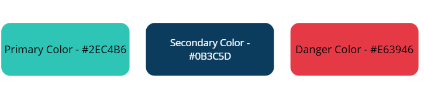

# 🎨 Design System

Este documento define os padrões visuais e de interface do sistema Rotina+.

# 🎨 Paleta de Cores

## 📌 Cores principais

  Primary Color - #2EC4B6

  Secondary Color - #0B3C5D

  Danger Color - #E63946

# 🔤 Tipografia

## 📌 Fonte principal
- Font-family: Inter, sans-serif

## 📌 Hierarquia

- H1: 32px / Bold
- H2: 24px / SemiBold
- H3: 20px / Medium
- Body: 16px / Regular
- Small: 14px / Regular

# 🧩 Componentes

## 🔘 Button

### Variações
- Primary
- Secondary
- Outline

### Estados
- Default
- Hover
- Disabled

## 📦 Card

### Uso
Container para agrupar informações.

# 📐 Espaçamento

## 📏 Escala de espaçamento

- 4px
- 8px
- 16px
- 24px
- 32px
- 48px

## 📌 Regra
Utilizar múltiplos de 8 para manter consistência visual.

# 📊 Grid

## 📌 Breakpoints

- Mobile: 320px
- Tablet: 768px
- Desktop: 1024px+