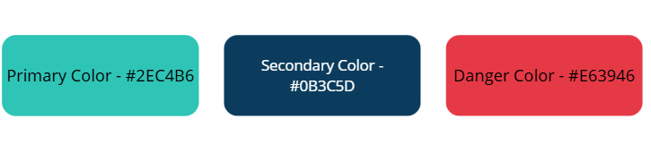

# Design System

Os padrões visuais do Rotina Plus, extraídos do código.

> **Escopo.** Este documento cobre **apenas o painel de tarefas** (`frontend/src/pages/Dashboard.css`). As telas de acesso — início, login, cadastro, verificação e recuperação de senha — não têm CSS próprio e usam o Bootstrap 5 puro, importado em `main.jsx`. `index.css` e `App.css` existem mas estão **vazios**. Não há tokens de design: todas as cores e medidas são valores hexadecimais escritos à mão, sem variáveis CSS.

---

## 1. Paleta de cores



A paleta vigente está em `Dashboard.css`. O antigo teal-claro `#2EC4B6` e o azul-escuro `#0B3C5D` que aparecem em versões anteriores deste documento **não existem mais no código**.

### Primárias e neutras

| Papel | Hex | Uso |
| :--- | :--- | :--- |
| Primary | `#0c7b83` | Botão principal, borda de foco, título da aba ativa, cor do link |
| Texto forte | `#17212b` | Títulos e rótulos principais |
| Texto secundário | `#60707a` | Descrições, legendas, `dt` |
| Texto terciário | `#73818a` | Contadores e informações menos relevantes |
| Fundo da página | `#f5f7f8` | `body` e fundo do painel |
| Superfície | `#ffffff` | Cartões e campos |
| Borda | `#dce3e6` | Bordas padrão |
| Borda de input | `#ccd7db` | `input` e `select` |

### Semânticas

| Papel | Texto | Fundo |
| :--- | :--- | :--- |
| Sucesso | `#236a3f` | `#d7f3df` |
| Info | `#075c7a` | `#cceff8` |
| Aviso | `#805b00` | `#fff1bf` |
| Perigo | `#c94b4b` | `#fff0f0` |
| Erro (texto) | `#9b2c2c` | `#fff0f0` |

O mesmo papel tem dois tons: um para texto e outro para fundo, sempre na mesma linha da tabela. É por isso que o badge de status e a mensagem de erro do painel têm cores parecidas — a diferença está no fundo, não só na cor.

### Badge de status

Os três status herdam as cores semânticas, com um badge dedicado por status:

| Status | Cor | Fundo |
| :--- | :--- | :--- |
| Pendente | `#805b00` | `#fff1bf` |
| Em andamento | `#075c7a` | `#cceff8` |
| Concluida | `#236a3f` | `#d7f3df` |

## 2. Tipografia

```css
font-family: Inter, ui-sans-serif, system-ui, -apple-system, BlinkMacSystemFont, "Segoe UI", sans-serif;
```

Definida uma única vez, no seletor `body`. A fonte `Inter` **não é carregada** — não há `@font-face` nem link para o Google Fonts. Quem não tiver a Inter instalada vê a `system-ui` do sistema. As telas de acesso herdam a fonte do Bootstrap (`system-ui`), não esta.

### Escala em uso

| Elemento | Tamanho |
| :--- | :--- |
| Título da página (`h1`) | `2rem` |
| Título de seção | `1.65rem` |
| Título da aba ativa | `1.5rem` |
| Título do cartão | `1.1rem` |
| Título do item de tarefa | `1.05rem` |
| Texto corrido | `0.92rem` |
| Rótulos e `dt` | `0.9rem` |
| Legendas | `0.8rem` |
| Badge de status | `0.78rem` |
| Microtexto | `0.75rem` |

Nenhum peso de fonte é declarado — oibold vem do `h1`–`h6` do Bootstrap. A hierarquia é feita só por tamanho e cor.

## 3. Espaçamento

Não há escala de espaçamento declarada. Os valores são usados caso a caso:

| Valor | Onde |
| :--- | :--- |
| `4px 8px` | Botões pequenos |
| `7px 8px` / `7px 12px` | Campos de formulário (o mais comum) |
| `9px 10px` / `9px 14px` | Badge, contador |
| `10px 16px` / `14px 16px` | Blocos de conteúdo |
| `16px` | Gap padrão entre itens |
| `22px 8px` / `28px 16px` / `24px 0 16px` | Cabeçalhos |
| `48px 24px` | Container do painel em telas estreitas |

A antiga regra "múltiplos de 8" não se aplica ao código atual: os valores de formulário usam 7 e 9px, escolhidos para alinhar texto e ícone.

## 4. Raios e formas

| Raio | Uso |
| :--- | :--- |
| `6px` | Padrão — campos, botões, cartões (8 ocorrências) |
| `8px` | Painel e contêineres maiores |
| `999px` | Formato de pílula (badge de status) |

## 5. Componentes

### Botões

Cinco classes, todas definidas em `Dashboard.css`. Todas compartilham `padding: 7px 12px`, `border-radius: 6px`, `cursor: pointer` e estado `:disabled` com opacidade reduzida.

| Classe | Cor | Uso |
| :--- | :--- | :--- |
| `.refresh-button` | `#0c7b83` com texto branco | Ação principal: adicionar tarefa, salvar, atualizar lista |
| `.concluir-button` | `#236a3f` | Marcar como concluída |
| `.voltar-button` | contorno cinza | Reabrir tarefa concluída |
| `.edit-button` | contorno `#0c7b83` | Entrar no modo de edição |
| `.delete-button` | contorno `#c94b4b` | Excluir |

`.refresh-button` tem o triplo de função — adicionar, salvar e atualizar — com o rótulo mudando conforme o contexto (`Adicionar tarefa`, `Salvando...`, `Atualizando...`). Os rótulos de estado ("Salvando...", "Atualizando...") substituem o texto original enquanto a requisição está em voo, e o botão fica desabilitado.

### Cartão de tarefa

`.task-item` — superfície branca, borda `#dce3e6`, raio 6px. Estrutura:

1. **Cabeçalho** — nome (`h2`) à esquerda, badge de status à direita.
2. **Descrição** — parágrafo, com o texto "Sem descrição." quando vazio.
3. **Grade de detalhes** — `<dl>` com dois pares rótulo/valor: Prioridade e Prazo. Prazo vazio vira "Sem prazo".
4. **Ações** — Concluir/Voltar, Editar, Excluir.

A data é formatada em `DD/MM/AAAA` a partir de `YYYY-MM-DD`, tratando o valor como texto — a conversão acontece no componente, não no backend.

### Abas

Duas abas — *Hoje* e *Futuras* — com a contagem entre parênteses. A aba ativa recebe a classe `active`, que troca a cor para o primary e a borda inferior para 2px na mesma cor.

### Estados de lista

| Elemento | Quando aparece |
| :--- | :--- |
| `.tasks-state` | Carregando, lista vazia, ou sem sessão |
| `.tasks-error` | Falha ao carregar ou ao salvar |
| `.tasks-notice` | Sem `userId` no token |

## 6. Layout e responsividade

O painel usa um contêiner com largura máxima e margens automáticas, com três áreas empilhadas: cabeçalho, resumo de pontos e lista.

Há **uma única media query**, em `640px`, que reduz o padding do contêiner para `48px 24px` e reorganiza a grade de detalhes. Não há breakpoints para tablet ou desktop — o layout é fluido por padrão.

## 7. Tema escuro

A navegação alterna entre `navbar-light bg-white` e `navbar-dark bg-dark`, trocando as classes do Bootstrap.

**O tema escuro não alcança o painel.** A classe fica na `navbar` e o `Dashboard.css` é escoped à tela, sem regras para o modo escuro — o painel renderiza sempre com a paleta clara. É a diferença mais visível entre o que o componente `Navbar` permite e o que existe de fato.

## 8. Grid

Não há grid próprio. As telas de acesso usam o sistema de grid do Bootstrap 5 (12 colunas); o painel usa flexbox e uma lista vertical.

Breakpoints aplicáveis: **640px** (única media query do projeto) e os defaults do Bootstrap — `576px`, `768px`, `992px`, `1200px`, `1400px`.

---

## Pendências do design system

- **Nenhuma imagem de referência existe** para tipografia, botões, cartões ou espaçamento. As antigas (`typography.png`, `button.png`, `card.png`, `spacing.png`) não estão no repositório.
- **Não há Figma vinculado.** O link no documento anterior estava vazio.
- **Nenhuma variável CSS.** Transformar os hexadecimais em custom properties em `:root` é o passo que falta para o design system virar um sistema.
- **`index.css` e `App.css` estão vazios e nem são importados** — `main.jsx` carrega apenas o Bootstrap e só `Dashboard.css` é usado.
- **O painel não tem modo escuro.**
- **O Bootstrap 5.3 traz o `data-bs-theme`** para tema escuro nativo; usá-lo em `<html>` substituiria a solução atual por classe na navbar.